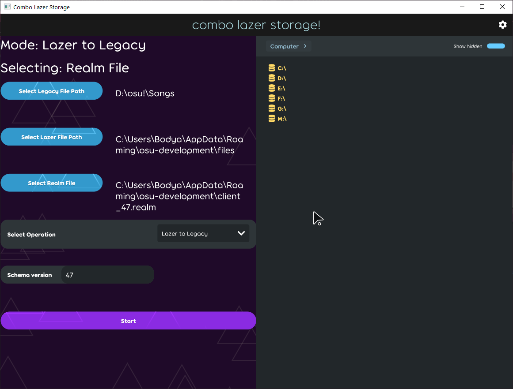

# NOTE: BACKUP EVERYTHING
# requirements:
dotnet 8.0 runtime, python with tkinter (for simpler legacy gui)

# what it is for
- copying lazer beatmap files to osu!stable filesystem format (operation mode 1)
- making symlinks from osu!stable filesystem format to use in lazer (operation mode 2)
- then using these symlinks to import into osu!lazer database (operation mode 3)

as a result, you will have a songs folder that is easy to restore in case osu!lazer database gets corrupted. also, you save space by being able to access the same file from both lazer and stable.
moreover, you get a bit more precise control over maps, although a bit limited for now (edited maps will be readded as new, realm will think hash for the file is the same while the file has changed)

## some other use cases:
- migrating database between different schema_versions
- merging multiple databases into one
# usage:
`dotnet build combolazerstorage.sln`, then launch `bin/Debug/net8.0/combolazerstorage.exe` **as admin (Windows)** or `dotnet run` (Linux)
>admin rights are needed for symlink creation
## example usage without gui (merging two databases together):
```
combolazerstorage.exe 1 D:\osul D:\osulazer_files C:\Users\%username%\Desktop\23\client_46.realm 46
combolazerstorage.exe 1 D:\osul D:\osulazer_files C:\Users\%username%\Desktop\linux\client_47.realm 47
combolazerstorage.exe 2 D:\osul C:\Users\%username%\AppData\Roaming\osu-development\files 46
combolazerstorage.exe 3 D:\osul C:\Users\%username%\AppData\Roaming\osu-development\files C:\Users\%username%\AppData\Roaming\osu-development\client_46.realm 46
```
